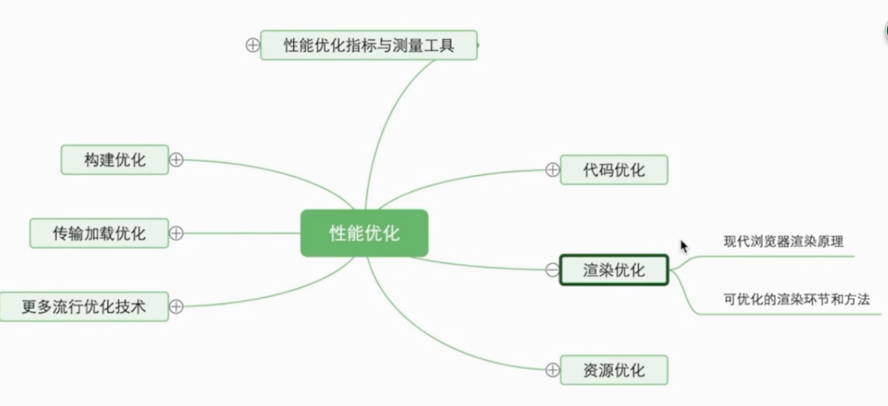

下面是大部分公司问的问题，当然极少一部分公司，
1，问问题时有点着急，急于让你一进公司就开始干活，所以问的问题也很基础，但是问得很详细
2，会拿着简历从头到尾的问，一般是你写了啥技能问啥，然后就是介绍一下你的项目中的亮点，所以对自己简历上写的一定要非常了解，不然可以不写相关的知识点。

#一、基础知识
##js相关知识
###原型、原型链的理解？
1. 原型: 每一个对象都具有原型,可以共享原型的属性和方法;
2. 原型链: 1)形成:原型对象也就有原型对象,形成原型链,一层层往上查找;2)目的: 主要为了继承;3)原型,构造函数,实例三者之间的关系

###原型链与作用域链的理解？
1. 每个对象都具有原型对象,原型对象也具有原型对象,最终都指向Object,
2. 执行环境相当于作用域,分为全局作用域和局部作用域,全局作用域相当于window,局部作用域相当于代码块,具有向上查找的特点;

###继承的几种方式以及优缺点
1. 原型链继承:
2. 构造函数继承:
3. 原型式继承:
4. 组合继承:
5. 寄生组合继承:

##es6常用的方法
扩展
###function普通函数和箭头函数的区别以及各自的应用场景
1. this指向: 普通函数指向本身作用域;箭头函数一般指向父级作用域;
2. prototype: 普通函数具有,箭头函数没有
3. arguments: 普通函数具有,箭头函数没有
4. new: 箭头函数没有
5. 重命名: 箭头函数不支持
** 灵活,可读,简洁
[具体地址]https://blog.csdn.net/m0_37686205/article/details/88776259

###数组常用的遍历方法
map和forEach遍历的区别，以及其余数组遍历方法的区别应用场景比如every 和some  filter
平时开发中遇到异步请求怎么处理，比如三个接口A、B、C，B请求接口时依赖A接口返回的数据，C依赖B接口返回的数据你怎么处理？
说一下你对async await的理解？
let const 和var的区别，如果我用const定义一个数组或者是对象，然后我再去修改这个数组或者对象，最后会怎么样？输出什么？
简单的说一下你对promise的理解?如果要你实现一个promise你会怎么考虑？

###简单说一下你对闭包的理解？
1. 函数中的函数
2. 在函数内部可以引用外部的参数和变量
3. 参数和变量不会以垃圾回收机制回收
``
有被问到过每一个数组的方法，以及每一个方法被调用后的返回值，是否改变了原数组？
apply、call和bind的区别
typeof都返回什么？
null和undefined的区别

节流和防抖的区别？以及如何手写？
## 性能优化都有什么方法？平时你在开发中使用过哪些？

1. 构建优化
2. 代码优化
3. 渲染
4. 资源
5. 传输

事件执行机制？如果有笔试，经常会考这个（各种输出，让你写出输出的顺序）
深拷贝和浅拷贝的区别？
敏捷开发的理解？
事件委托与事件代理？
cookie和session的区别？
break、continue和return的区别？

从浏览器地址输入http到页面展示出来都经历了什么？

http请求的主要方法
请求结束后，返回的状态码都有哪些？
扩展
能说一下get和put的主要区别在哪里吗
es6的模块化和commonJs模块化的区别

html和css
标准和模型和IE盒模型的区别？
基本的布局方法？
块级元素垂直居中的方法
flex布局，just-content和aline-item就只能是横向和纵向布局吗？如果想改变，怎么实现
说你下你对BFC的理解
清除浮动都有哪些方法？
html5和css3新增的功能？
移动端在写样式的时候，都有哪些单位？
扩展：
px转换为这些单位，他的原理是什么？

说一下你对前端工程化的理解？
扩展
你对于webpack的了解？
webpack中常用的loader和plugins?
如果需要你做一个一键换肤功能，你觉得应该怎么处理？

二、框架
vue常见问题
vue的生命周期
watch和 computed的区别
v-if和v-show的区别，你平时在开发中如何使用？
扩展
如果我们需要频繁的操作dom,我们还可以用什么方法？

vue.nextTick的理解？
vue哪些情况可以造成页面的渲染
vue中循环遍历的时候为什么要加key?
数据的双向绑定
为什么vue组件中data要用函数不用对象？
vue中常见的传值的方法？
vuex的使用
vue的filter 以及drective的基本使用
vue中选择元素，操作dom结构的方法
vue自身封装的组件
vue-router

react常见的问题
setStata里面的得参数是什么？
扩展
setState是同步还是异步？
state和prop的区别？
react的生命周期
react父子组件间的传值
纯函数pureComponent和普通的class Component有啥区别
写了一个空的函数式组件，在引入的时候为什么会当做函数式组件进行解析  
扩展
函数式组件的相关的钩子
个人觉得比较傻逼的问题：
说一下你对react的理解
